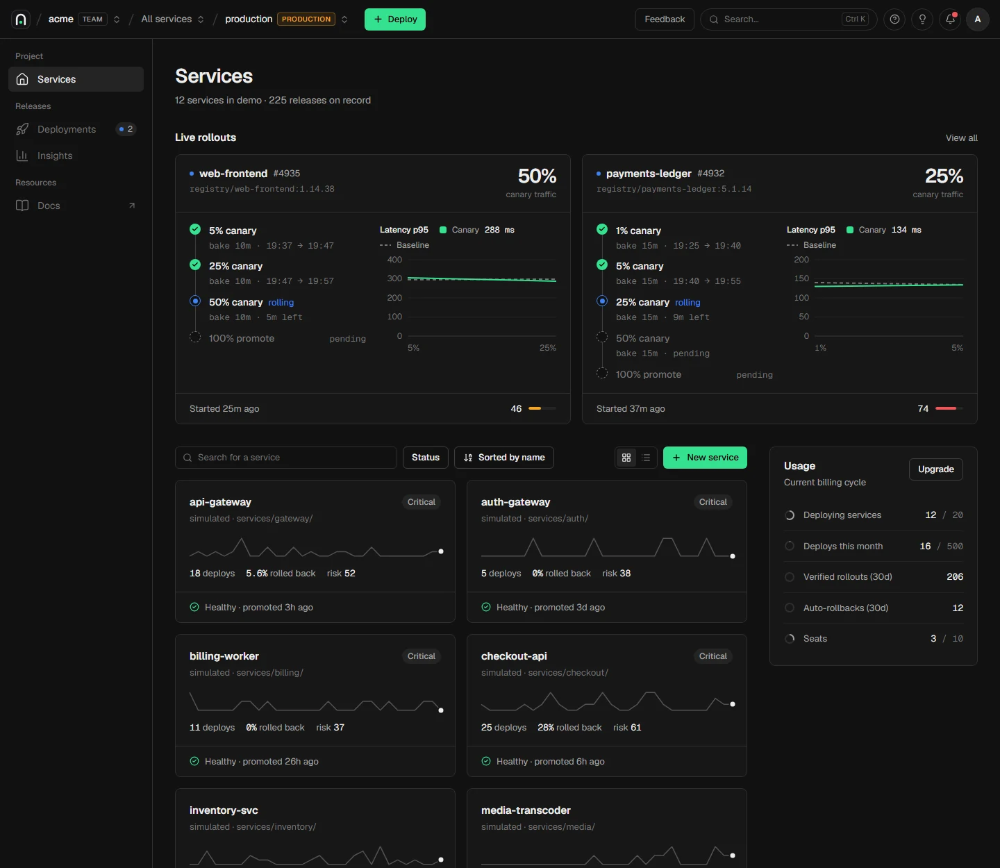
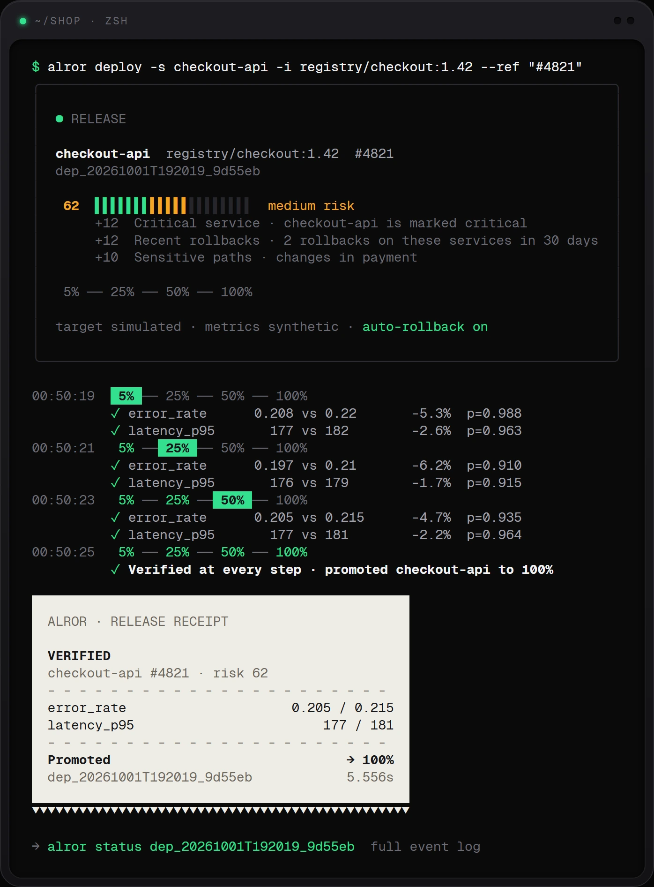
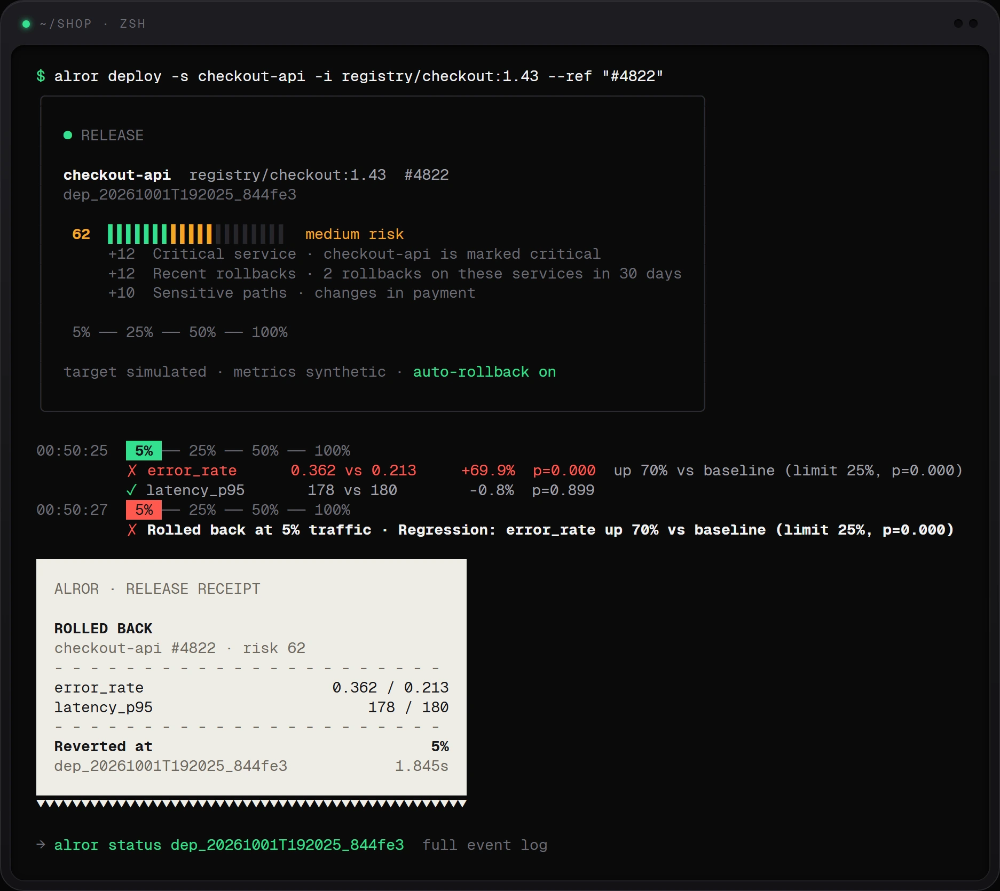
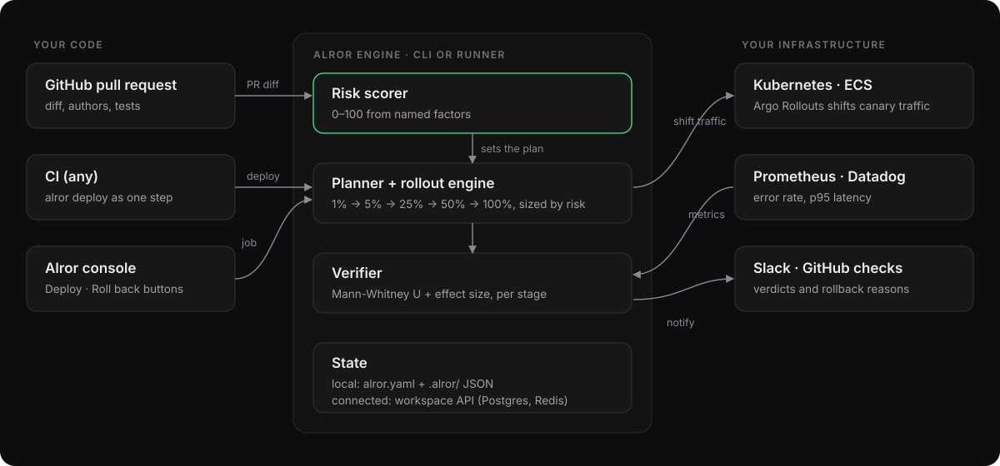

<p align="center">
  
</p>

<h1 align="center">Alror</h1>

<p align="center">
  <b>The release gate for the age of AI-written code.</b><br/>
  Alror scores every change for risk, rolls it out as a canary sized to that risk,<br/>
  verifies each step against live metrics, and rolls back on its own when a release hurts users.
</p>

<p align="center">
  <a href="https://alror.com">Website</a> ·
  <a href="internal/docsite/content/quickstart.md">Quickstart</a> ·
  <a href="#documentation">Docs</a> ·
  <a href="docker/README.md">Self-hosting</a> ·
  <a href="https://github.com/alrors/alror/releases">Releases</a> ·
  <a href="CONTRIBUTING.md">Contributing</a>
</p>

<p align="center">
  <a href="https://github.com/alrors/alror/actions/workflows/ci.yml"></a>
  <a href="https://github.com/alrors/alror/releases"></a>
  <a href="LICENSE"></a>
  
  
</p>

---

Alror is open source. Teams merge more changes than ever, many written by agents, yet most pipelines still treat a green test run as proof that a change is safe. Alror is the step between merge and production that makes that true.

- [x] **Change risk scoring.** A 0–100 score from named, auditable factors: critical services, sensitive paths, migrations, missing tests, agent-authored commits, recent rollbacks. ([Docs](internal/docsite/content/risk-scoring.md))
- [x] **Risk-sized canaries.** Low risk goes 25% → 100%. High risk goes 1% → 5% → 25% → 50% → 100% with longer bakes. ([Docs](internal/docsite/content/rollouts.md))
- [x] **Statistical verification.** Each stage compares canary and baseline with a Mann-Whitney U test **and** an effect-size threshold, so noise doesn't trigger rollbacks. ([Docs](internal/docsite/content/rollouts.md))
- [x] **Automatic rollback.** A regression shifts traffic back in seconds, with a plain-English reason, and `alror deploy` exits with code `2` so CI goes red. ([Docs](internal/docsite/content/rollouts.md))
- [x] **GitHub checks.** A risk check run and a sticky comment on every pull request, plus `check` and `deploy` actions. ([Docs](internal/docsite/content/github.md))
- [x] **Targets and metrics.** Kubernetes via Argo Rollouts, Amazon ECS (beta), Prometheus, Datadog, Slack. ([Docs](internal/docsite/content/targets.md))
- [x] **Workspace console.** Live rollouts, release stories, insights, policies, API keys, audit log and a plugin marketplace. ([Docs](internal/docsite/content/console.md))
- [x] **Runner.** `alror runner` executes deploys and rollbacks queued from the console inside your own infrastructure. ([Docs](internal/docsite/content/connected.md))
- [x] **SDKs.** Go and TypeScript clients for the workspace API. ([Docs](#client-libraries))

<p align="center">
  
</p>

**Watch "releases" of this repo** to get notified of new versions.

<p align="center">
  
  
</p>

## Documentation

The docs live in [`internal/docsite/content`](internal/docsite/content) and are served offline by `alror docs`.

| Guide | |
| --- | --- |
| [Quickstart](internal/docsite/content/quickstart.md) | Install, `alror init`, your first verified rollout |
| [Configuration](internal/docsite/content/configuration.md) | `alror.yaml`, services, policy and plans |
| [Risk scoring](internal/docsite/content/risk-scoring.md) · [Rollouts](internal/docsite/content/rollouts.md) | How changes are scored and verified |
| [Targets and metrics](internal/docsite/content/targets.md) | Kubernetes, ECS, Prometheus, Datadog |
| [GitHub](internal/docsite/content/github.md) | Check runs, PR comments, actions |
| [Connected mode](internal/docsite/content/connected.md) | `alror login`, the workspace API and `alror runner` |
| [CLI reference](internal/docsite/content/cli.md) | Every command and flag |
| [Architecture](ARCHITECTURE.md) · [Platform API](docs/platform-contract.md) | Internals and the REST contract |

## Community & support

- [GitHub Issues](https://github.com/alrors/alror/issues): bugs and errors you run into.
- [GitHub Discussions](https://github.com/alrors/alror/discussions): questions, ideas and help with your setup.
- [Security](SECURITY.md): report vulnerabilities privately.

## How it works

Alror is a release engine plus a workspace. The engine runs inside the `alror` CLI, usually as one step in CI, or inside `alror runner` for deploys started from the console. It needs nothing hosted: in local mode its whole state is `alror.yaml` and plain JSON under `.alror/`.

<p align="center">
  
</p>

- **Risk scorer** ([`internal/risk`](internal/risk)) reads the git diff and history and returns a score with every factor that moved it.
- **Planner and rollout engine** ([`internal/rollout`](internal/rollout)) pick the canary steps and bakes from the score and drive the state machine.
- **Verifier** ([`internal/verify`](internal/verify)) compares canary and baseline samples per metric and decides pass or roll back.
- **Drivers** ([`internal/driver`](internal/driver)) shift traffic: Argo Rollouts on Kubernetes, ECS target-group weights, or a simulated target for trying it out.
- **Metrics providers** ([`internal/metrics`](internal/metrics)) query Prometheus or Datadog, or generate synthetic samples.
- **Workspace** ([`apps/web`](apps/web)) is a Next.js app with the website, the console and the `/api/v1` REST API, on PostgreSQL and Redis. The CLI connects to it with an API key.

## Install

```bash
# macOS / Linux
curl -fsSL https://raw.githubusercontent.com/alrors/alror/main/scripts/install.sh | sh

# Windows (PowerShell)
irm https://raw.githubusercontent.com/alrors/alror/main/scripts/install.ps1 | iex

# Go 1.22+
go install github.com/alrors/alror/cmd/alror@latest
```

```bash
alror init        # writes alror.yaml
alror risk        # score the current branch
alror deploy -s checkout-api -i registry.example.com/checkout-api:v2
```

Add the risk check to pull requests:

```yaml
- uses: alrors/alror/actions/check@main
```

## Client libraries

| Language | Package | Source |
| --- | --- | --- |
| Go | `github.com/alrors/alror/pkg/alror` | [`pkg/alror`](pkg/alror) |
| TypeScript / JavaScript | `@alror/sdk` (not on npm yet) | [`sdk/js`](sdk/js) |
| CLI via npm | `alror` (not on npm yet) | [`npm`](npm) |

## Self-hosting

Run the workspace (website, console and API) with PostgreSQL, Redis and automatic HTTPS:

```bash
git clone https://github.com/alrors/alror && cd alror/docker
cp .env.example .env && docker compose up -d
```

See [`docker/README.md`](docker/README.md).

## Repository layout

```
cmd/            alror, alror-docs and a dev API server
internal/       engine: risk, rollout, verify, driver, metrics, store, runner, cli, docs
pkg/alror       Go SDK
apps/web        website, console and /api/v1 (Next.js, PostgreSQL, Redis)
sdk/js          TypeScript SDK
npm             npm launcher packages
actions         GitHub Actions: check and deploy
docker          self-hosting
docs            platform contract, images
```

## License

[Apache-2.0](LICENSE).
